# Somnia Network — RPC Load Test (GCP Machines)

## Agenda

* Scope and objectives
* Test plan and traffic model
* Workload mix and environment
* Results of each scenario
* Cross-machine comparison
* Bottlenecks and causes
* Recommendations
* Risks and limits
* Next steps

---

## Scope and Objectives

* Focus only on **read-only RPC traffic**
* Single endpoint in one GCP region
* Objectives:

  * Validate latency and error targets
  * Measure maximum stable throughput
  * Identify first bottlenecks (CPU, disk, network)
  * Provide actionable recommendations
* Each scenario shows the **highest stable load** before KPI failures

---

## Test Plan and Traffic Model

* Same script in all runs

  * Each iteration = `eth_blockNumber` + one weighted RPC
  * ~2 HTTP requests per iteration
* Stages:

  * **Warm-up**: ~1–2k iterations/s for 2 min
  * **Step load**: up to 10–21k iterations/s for 12 min
  * **Spike**: 20s at peak load
* **Thresholds for all scenarios**:

  * p95 < 300 ms
  * p99 < 700 ms
  * Error rate < 1%
* ✅ All scenarios passed these thresholds


---

## Workload Mix

* `eth_getBalance`: 35%
* `eth_blockNumber`: 20%
* `eth_getBlockByNumber`: 20%
* `eth_chainId`: 8%
* `net_version`: 7%
* `eth_getLogs`: 2%
* **No batching** — each request independent

---

## Environment

* Endpoint: private GCP address (low network latency)
* Tools: k6 + Grafana dashboards (CPU, memory, disk, network)
* Machines tested:

  * **No.1**: n2d-highmem-32 (AMD, 32 cores, 256 GB)
  * **No.2**: n2d-highmem-16 (AMD, 16 cores, 128 GB)
  * **No.3**: n2-highmem-32 (Intel, 32 cores, 256 GB)
  * **No.4**: n2-standard-48 (Intel, 48 cores, 192 GB)

---

## Results by Scenario

### Scenario 1 — n2d-highmem-32

* Throughput: ~12.3k req/s
* Latency: p95 = 2.36 ms, p99 = 53.5 ms
* Error rate: 0.79% ✅
* Bottleneck: Disk IO (write peak ~93 MB/s, iowait ~60–65%)
* Notes: Best latency profile

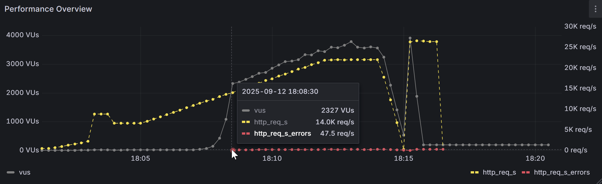
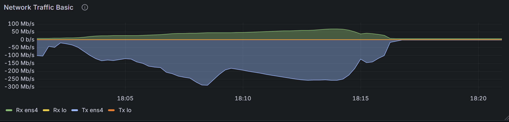
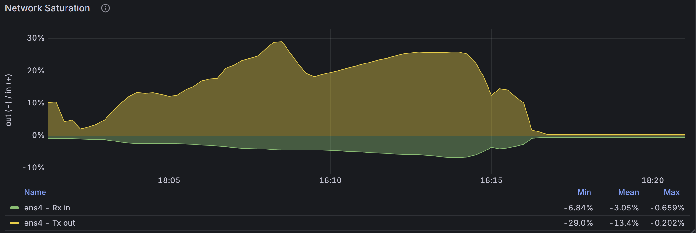
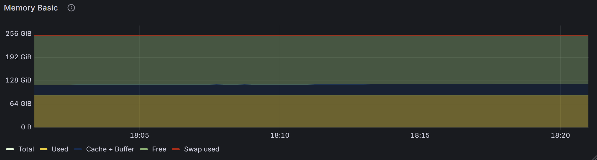
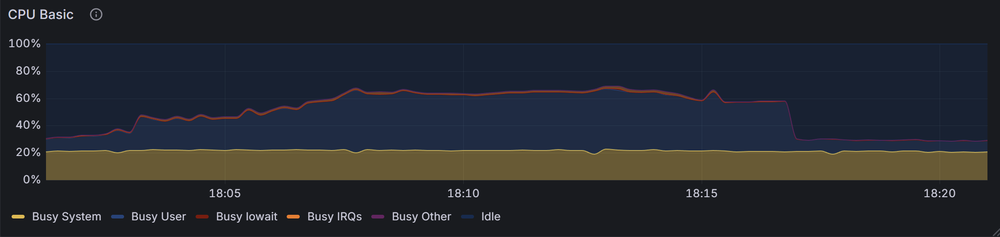
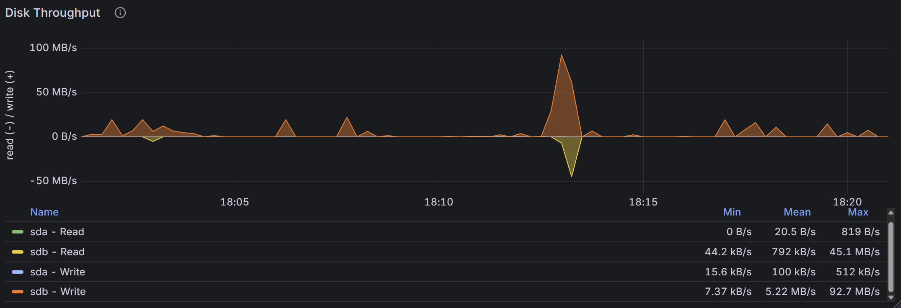


### Scenario 2 — n2d-highmem-16

* Throughput: ~11.1k req/s
* Latency: p95 = 10 ms, p99 = 178 ms
* Error rate: 0.87% ✅
* Bottleneck: Disk IO saturation (write peak ~78 MB/s,iowait up to ~95%)
* Notes: Stable only at medium load

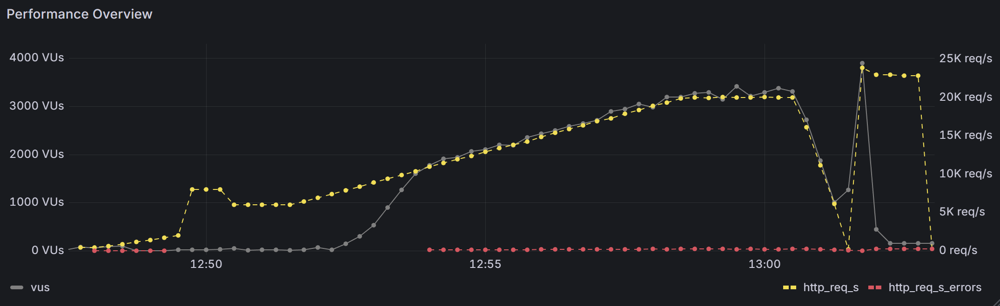

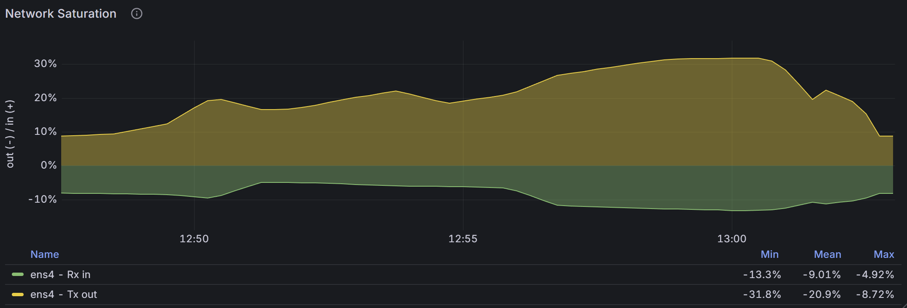
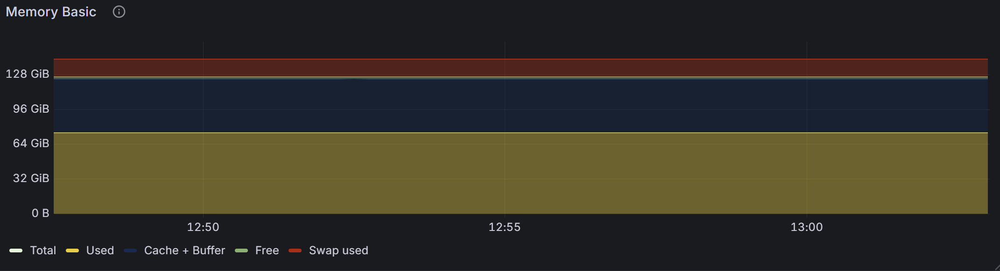
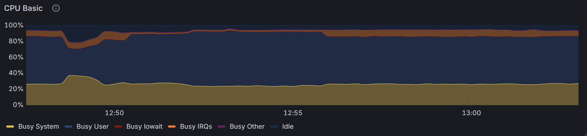
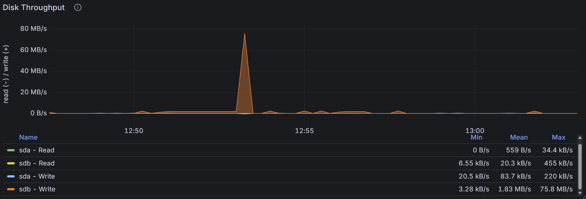


### Scenario 3 — n2-highmem-32

* Throughput: ~19.8k req/s
* Latency: p95 = 13 ms, p99 = 190 ms
* Error rate: 0.91% ✅
* Bottleneck: Disk IO (write peak ~45 MB/s,iowait ~40–45%)
* Notes: Balanced throughput vs latency

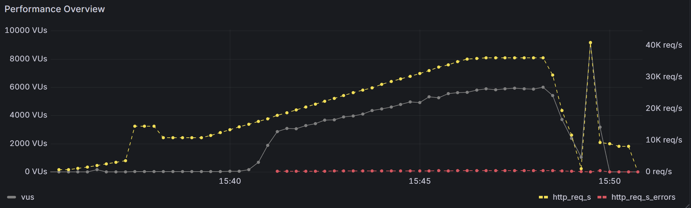
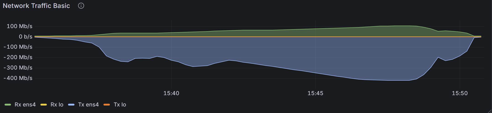
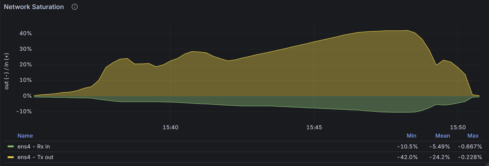
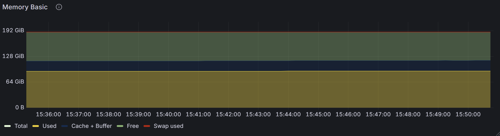
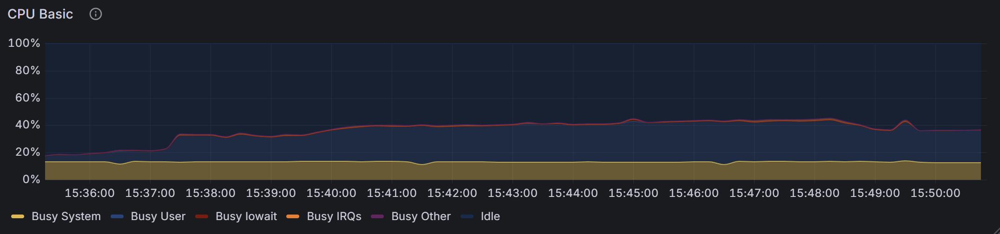
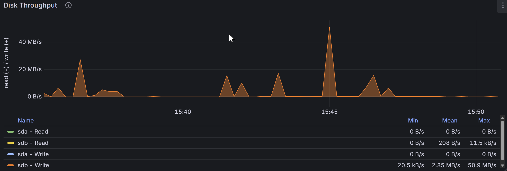

### Scenario 4 — n2-standard-48

* Throughput: ~23.1k req/s
* Latency: p95 = 21 ms, p99 = 346 ms
* Error rate: 0.92% ✅
* Bottleneck: Disk IO (write peak ~51 MB/s, iowait ~60–65%)
* Notes: Highest throughput option

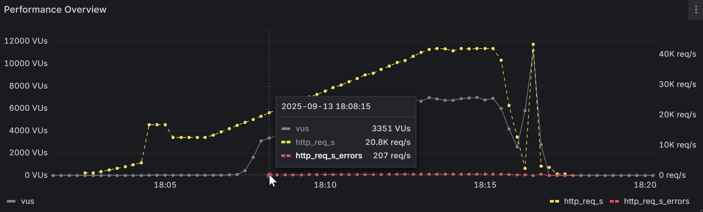
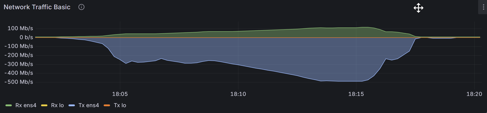
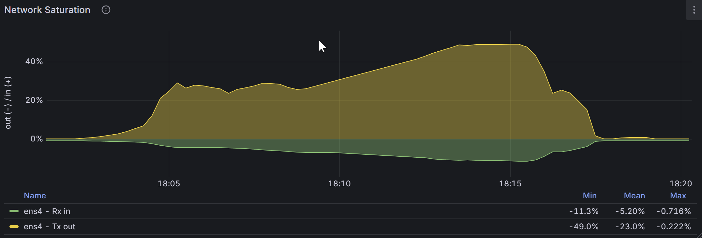
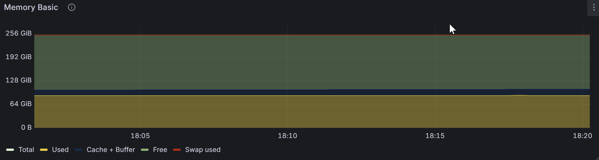
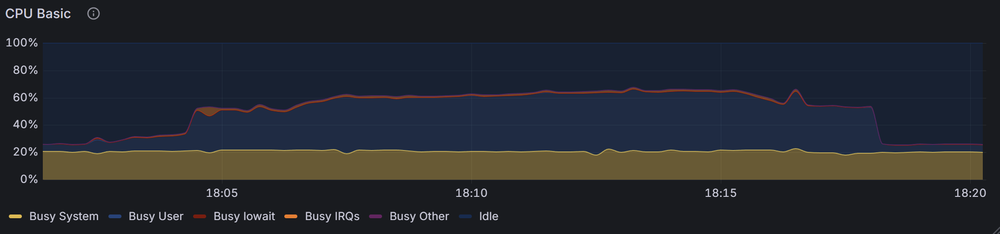
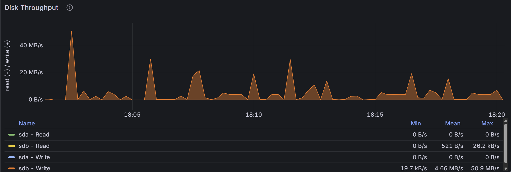

---

## Cross-Machine Comparison

* **No.1 (n2d-32)** → Best latency (~53 ms p99), ~12k req/s
* **No.2 (n2d-16)** → Early bottlenecks, ~11k req/s, high iowait
* **No.3 (n2-32)** → Balanced ~20k req/s, p99 ~190 ms
* **No.4 (n2-48)** → Highest throughput ~23k req/s, p99 ~346 ms
* ✅ All error rates <1%, clustered at top step and spike phases

---

## Bottlenecks and Causes

* **Disk IO**: main limiter across all machines

  * High iowait at heavy load (No.2 peaked at ~95%)
  * Write bursts caused short error pockets
* **CPU**: not saturated in user mode; waiting on IO is the real limit
* **Network**: scaled with throughput; no link saturation
* **Memory**: stable; no swap used
* Key causes: block and log fetch methods drive storage pressure

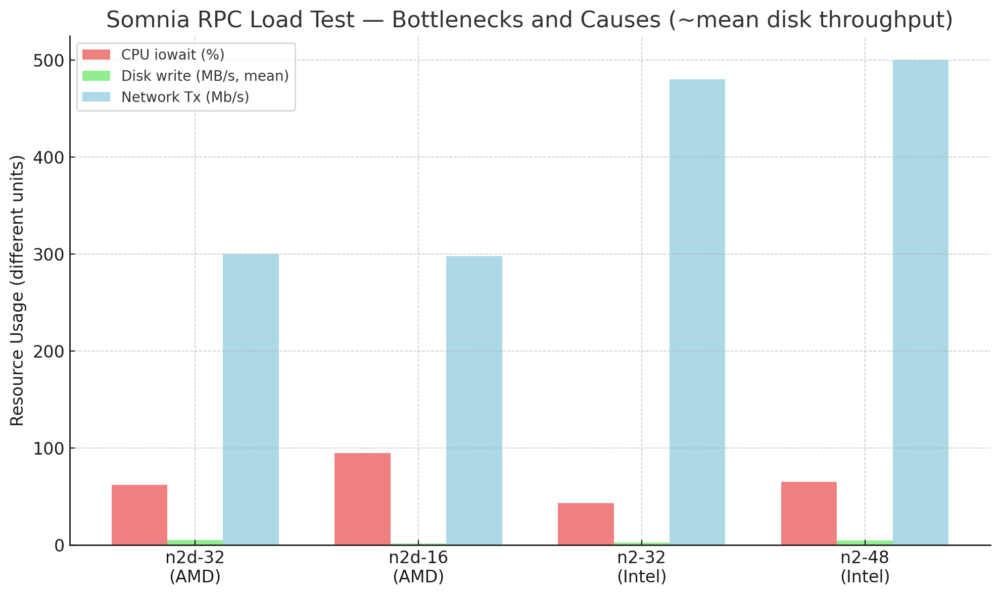

---

## Recommendations

* Lowest latency: **n2d-highmem-32** + faster storage, bigger caches
* Highest throughput: **n2-standard-48**; accept higher tail latency
* Balanced: **n2-highmem-32** (~20k req/s, good tails)
* Improvements:

  * Use Local SSD or high-IOPS disks
  * Increase caches for hot blocks/logs
  * Try small batching (4–8 calls)
  * Deploy multiple RPC nodes behind a load balancer

---

## Risks and Limits

* Read-only workload; no write or consensus tested
* Single region, single endpoint; no HA or failover
* Synthetic traffic mix; real usage may differ
* Costs not included
* Environment constraints:

  * Different disk architectures across tests
  * OS/network tuning not fully optimized
  * Network saturation panels are estimates, not absolutes
* Test design:

  * A load test must focus on specific aspects
  * It is impossible to include all influencing factors
  * The number of aspects grows exponentially


# K6 and Prometheus Setup Guide

This guide provides step-by-step instructions to install k6, run a k6 test with Prometheus output, set up the required environment variable, and configure a Prometheus service using a systemd unit file.

## Prerequisites

- A Linux-based system (e.g., Ubuntu, CentOS, or similar).
- Root or sudo privileges for installing packages and configuring services.
- Access to the internet for downloading k6 and Prometheus.

## Step 1: Install k6

Follow these steps to install k6 on your system:

1. **Add the k6 repository key**:
```bash
   sudo gpg --no-default-keyring --keyring /usr/share/keyrings/k6-archive-keyring.gpg --keyserver hkp://keyserver.ubuntu.com:80 --recv-keys C5AD17C747825693
```
### Add the k6 repository:For Debian/Ubuntu-based systems:
```
echo "deb [signed-by=/usr/share/keyrings/k6-archive-keyring.gpg] https://dl.k6.io/deb stable main" | sudo tee /etc/apt/sources.list.d/k6.list
```
### Update the package list and install k6:
```
sudo apt-get update
sudo apt-get install k6
```
### Verify k6 installation:
```
k6 version
```
## Step 2: Run k6 Test with Prometheus Output
To execute a k6 test and send the results to a Prometheus instance, run the following command:
```
k6 run -o experimental-prometheus-rw v4-somnia.js
```
Ensure the **v4-somnia.js** file is present in your working directory.
The **-o experimental-prometheus-rw** flag enables k6 to send metrics to a Prometheus server configured for remote write.

## Step 3: Set Prometheus Environment Variable
Set the environment variable to specify the Prometheus server URL for remote write:
```
export K6_PROMETHEUS_RW_SERVER_URL=http://10.132.0.3:9090/api/v1/write
```
This tells k6 where to send the metrics. Replace **http://10.132.0.3:9090/api/v1/write** with your actual Prometheus server URL if different.
To make this environment variable persistent, add it to your shell configuration file (e.g., **~/.bashrc or ~/.zshrc**):

```
echo 'export K6_PROMETHEUS_RW_SERVER_URL=http://10.132.0.3:9090/api/v1/write' >> ~/.bashrc
source ~/.bashrc
```
## Step 4: Configure Prometheus Service
To set up Prometheus as a systemd service, create a service file with the provided configuration.


### installing promethus:
```
#!/bin/bash
#PROMETHEUS_VERSION="2.24.0"
PROMETHEUS_VERSION=$(curl -sL https://api.github.com/repos/prometheus/prometheus/releases/latest | grep "tag_name"   | sed -E 's/.*"([^"]+)".*/\1/'|sed 's/v//')
wget https://github.com/prometheus/prometheus/releases/download/v${PROMETHEUS_VERSION}/prometheus-${PROMETHEUS_VERSION}.linux-amd64.tar.gz
tar -xzvf prometheus-${PROMETHEUS_VERSION}.linux-amd64.tar.gz
cd prometheus-${PROMETHEUS_VERSION}.linux-amd64/
# if you just want to start prometheus as root
#./prometheus --config.file=prometheus.yml

# create user
useradd --no-create-home --shell /bin/false prometheus 

# create directories
mkdir -p /etc/prometheus
mkdir -p /var/lib/prometheus

# set ownership
chown prometheus:prometheus /etc/prometheus
chown prometheus:prometheus /var/lib/prometheus

# copy binaries
cp prometheus /usr/local/bin/
cp promtool /usr/local/bin/

chown prometheus:prometheus /usr/local/bin/prometheus
chown prometheus:prometheus /usr/local/bin/promtool

# copy config
cp -r consoles /etc/prometheus
cp -r console_libraries /etc/prometheus
cp prometheus.yml /etc/prometheus/prometheus.yml

chown -R prometheus:prometheus /etc/prometheus/consoles
chown -R prometheus:prometheus /etc/prometheus/console_libraries

# setup systemd
echo '[Unit]
Description=Prometheus
Wants=network-online.target
After=network-online.target

[Service]
User=prometheus
Group=prometheus
Type=simple
ExecStart=/usr/local/bin/prometheus \
    --config.file /etc/prometheus/prometheus.yml \
    --storage.tsdb.path /var/lib/prometheus/ \
    --storage.tsdb.retention=150d \
    --web.console.templates=/etc/prometheus/consoles \
    --web.console.libraries=/etc/prometheus/console_libraries \
    --web.enable-lifecycle
ExecReload=/bin/kill -HUP $MAINPID
[Install]
WantedBy=multi-user.target' > /etc/systemd/system/prometheus.service

systemctl daemon-reload
systemctl enable prometheus
systemctl start prometheus
```

Create the Prometheus systemd service file:
```
sudo nano /etc/systemd/system/prometheus.service
```

### Add the following content:
```
[Unit]
Description=Prometheus
Wants=network-online.target
After=network-online.target

[Service]
User=root
Group=root
Type=simple
ExecStart=/usr/local/bin/prometheus \
    --config.file=/etc/prometheus/prometheus.yml \
    --storage.tsdb.path=/var/lib/prometheus/ \
    --storage.tsdb.retention.time=10d \
    --web.console.templates=/etc/prometheus/consoles \
    --web.enable-remote-write-receiver \
    --web.console.libraries=/etc/prometheus/console_libraries \
    --web.enable-lifecycle
ExecReload=/bin/kill -HUP $MAINPID
Restart=on-failure

[Install]
WantedBy=multi-user.target
```
**Save and exit the editor (Ctrl+O, then Ctrl+X in nano).**
```
sudo systemctl daemon-reload
sudo systemctl enable prometheus
sudo systemctl start prometheus
sudo systemctl status prometheus
```
