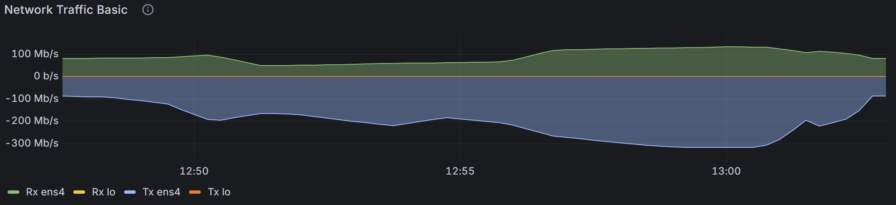

# Somnia Network — RPC Load Test (GCP Machines)

## Agenda

* Scope and objectives
* Test plan and traffic model
* Workload mix and environment
* Results of each scenario
* Cross-machine comparison
* Bottlenecks and causes
* Recommendations
* Risks and limits
* Next steps

---

## Scope and Objectives

* Focus only on **read-only RPC traffic**
* Single endpoint in one GCP region
* Objectives:

  * Validate latency and error targets
  * Measure maximum stable throughput
  * Identify first bottlenecks (CPU, disk, network)
  * Provide actionable recommendations
* Each scenario shows the **highest stable load** before KPI failures

---

## Test Plan and Traffic Model

* Same script in all runs

  * Each iteration = `eth_blockNumber` + one weighted RPC
  * ~2 HTTP requests per iteration
* Stages:

  * **Warm-up**: ~1–2k iterations/s for 2 min
  * **Step load**: up to 10–21k iterations/s for 12 min
  * **Spike**: 20s at peak load
* **Thresholds for all scenarios**:

  * p95 < 300 ms
  * p99 < 700 ms
  * Error rate < 1%
* ✅ All scenarios passed these thresholds

---

## Workload Mix

* `eth_getBalance`: 35%
* `eth_blockNumber`: 20%
* `eth_getBlockByNumber`: 20%
* `eth_chainId`: 8%
* `net_version`: 7%
* `eth_getLogs`: 2%
* **No batching** — each request independent

---

## Environment

* Endpoint: private GCP address (low network latency)
* Tools: k6 + Grafana dashboards (CPU, memory, disk, network)
* Machines tested:

  * **No.1**: n2d-highmem-32 (AMD, 32 cores, 256 GB)
  * **No.2**: n2d-highmem-16 (AMD, 16 cores, 128 GB)
  * **No.3**: n2-highmem-32 (Intel, 32 cores, 256 GB)
  * **No.4**: n2-standard-48 (Intel, 48 cores, 192 GB)

---

## Results by Scenario

### Scenario 1 — n2d-highmem-32

* Throughput: ~12.3k req/s
* Latency: p95 = 2.36 ms, p99 = 53.5 ms
* Error rate: 0.79% ✅
* Bottleneck: Disk IO (write peak ~93 MB/s, iowait ~60–65%)
* Notes: Best latency profile

### Scenario 2 — n2d-highmem-16

* Throughput: ~11.1k req/s
* Latency: p95 = 10 ms, p99 = 178 ms
* Error rate: 0.87% ✅
* Bottleneck: Disk IO saturation (iowait up to ~95%)
* Notes: Stable only at medium load

### Scenario 3 — n2-highmem-32

* Throughput: ~19.8k req/s
* Latency: p95 = 13 ms, p99 = 190 ms
* Error rate: 0.91% ✅
* Bottleneck: Disk IO (writes ~37 MB/s, iowait ~40–45%)
* Notes: Balanced throughput vs latency

### Scenario 4 — n2-standard-48

* Throughput: ~23.1k req/s
* Latency: p95 = 21 ms, p99 = 346 ms
* Error rate: 0.92% ✅
* Bottleneck: Disk IO (writes ~51 MB/s, iowait ~60–65%)
* Notes: Highest throughput option

---

## Cross-Machine Comparison

* **No.1 (n2d-32)** → Best latency (~53 ms p99), ~12k req/s
* **No.2 (n2d-16)** → Early bottlenecks, ~11k req/s, high iowait
* **No.3 (n2-32)** → Balanced ~20k req/s, p99 ~190 ms
* **No.4 (n2-48)** → Highest throughput ~23k req/s, p99 ~346 ms
* ✅ All error rates <1%, clustered at top step and spike phases

---

## Bottlenecks and Causes

* **Disk IO**: main limiter across all machines

  * High iowait at heavy load (No.2 peaked at ~95%)
  * Write bursts caused short error pockets
* **CPU**: not saturated in user mode; waiting on IO is the real limit
* **Network**: scaled with throughput; no link saturation
* **Memory**: stable; no swap used
* Key causes: block and log fetch methods drive storage pressure

---

## Recommendations

* Lowest latency: **n2d-highmem-32** + faster storage, bigger caches
* Highest throughput: **n2-standard-48**; accept higher tail latency
* Balanced: **n2-highmem-32** (~20k req/s, good tails)
* Improvements:

  * Use Local SSD or high-IOPS disks
  * Increase caches for hot blocks/logs
  * Try small batching (4–8 calls)
  * Deploy multiple RPC nodes behind a load balancer

---

## Risks and Limits

* Read-only workload; no write or consensus tested
* Single region, single endpoint; no HA or failover
* Synthetic traffic mix; real usage may differ
* Costs not included
* Environment constraints:

  * Different disk architectures across tests
  * OS/network tuning not fully optimized
  * Network saturation panels are estimates, not absolutes
* Test design:

  * A load test must focus on specific aspects
  * It is impossible to include all influencing factors
  * The number of aspects grows exponentially

---

## Next Steps

* Enable small batch requests and re-test
* Repeat with Local SSD or tuned disk options
* Run multiple nodes behind a load balancer
* Conduct long-duration tests (1–2 hours)
* Add cost-per-request analysis for each machine

